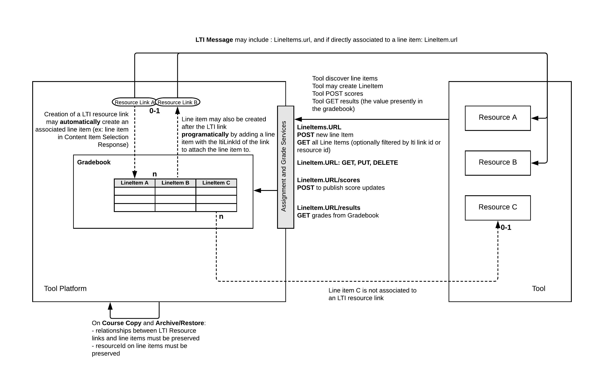
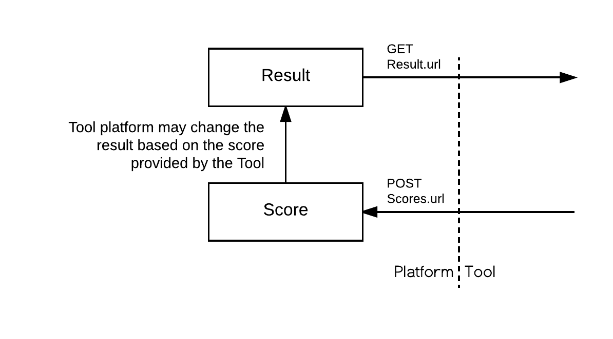
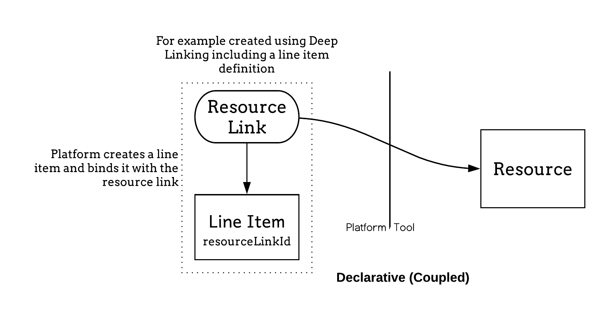
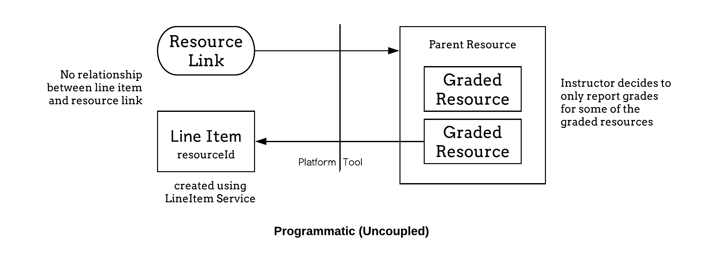

var md = `

## Introduction

### Overview

Assignment and Grade Services are based on IMS Learning Information Services
(LIS) [[!LIS-20]]. The Basic Outcomes service introduced in LTI 1.1 [[LTI-11]]
provides a simple facility for associating a single gradebook column with each
resource link and allows a tool to manage results in these columns as decimal
normalized values.  The creation of the gradebook column is typically part of
 the LTI link configuration within the tool platform's interface.

This document builds upon the concepts and terms introduced in the
LTI 1.3 specification [[!LTI-13]], specifically:

* The notions of <em>platforms</em> and <em>tools</em> as participants in an LTI
workflow
* The organization of collections of <em>resources</em> within <em>contexts</em>
* The interactions of <em>messages</em> and <em>services</em>

The Assignment and Grade Services, as described in this document, replace the
Basic Outcomes service and significantly extends the ability of the tool to
interact with the tool platform's gradebook by:

* Supporting the declarative model established by basic outcome
(tool platform creating a gradebook column on link creation)
* Allowing direct access and management of the gradebook columns
(allowing the tool to programmatically create gradebook columns)
* More expressiveness on the score information including maximum points
and grading status

Notably, the Assignment and Grade Services removes the strict one-to-one
relationship between a resource link and a line item:

* Resource link may have more than one related line items
* Line items may be created without any explicit relationship
to any Resource Link

The specification supports the auto-create flow to support simpler cases where the creation
of the line item is delegated to the platform upon resource link creation
(either as a setting or a line item declaration in the content item definition),
allowing a straight migration from the basic outcome service.

The Assignment and Grade Services are made of 3 services:

* **LineItem service**: Management of line items
* **Score Service**: Posting of scores by the tool. This service is a Write Only
service (syncing grades to platform)
* **Result Service**: Getting current grades from the platform's gradebook
This is a Read Only service.

Note that in any case the Assignment and Grade Services only expose gradebook
information directly tied to the tool deployment. Other information in the tool
platform's gradebook is not visible nor modifiable by the tool.

<figure id="ags-overview" class="graphic">

    
    		<figcaption>Assignment and Grade Services Overview</figcaption>
</figure>

<section id="conformance">
  <h3>Conformance Statements</h3>
</section>

<section id="documentset">
  <h3>Document Set</h3>

  <section>
   <h4>Normative Documents</h4>   
  <dl>
    <dt>LTI Advantage Conformance Certification Guide [[!LTI-CERT-13]]</dt>
     <dd>The LTI Advantage Conformance Certification Guide describes the procedures 
     for testing Platforms and Tools against the LTI v1.3 and LTI Advantage services
     using the IMS certification test suite.</dd>
  </dl>
  </section>
  <section>
   <h4>Informative Documents</h4>
  <dl>
    <dt>LTI Advantage Implementation Guide [[LTI-IMPL-13]]</dt>
    <dd>The LTI Advantage Implementation Guide provides information to lead 
   you to successful implementation and certification of the LTI Core v1.3 specification 
   and the set of LTI Advantage specifications.</dd>
  </dl>
  </section>
</section>

### Nomenclature

<dl class="termlist" data-sort id="terms">
  <dt><dfn>Line item</dfn></dt>
  <dd>A line item is usually a column in the tool platform's gradebook; it is able to
hold the results associated with a specific activity for a set of users.  
The activity is expected to be associated with a single LTI context within the
platform, so there is a one-to-many relationship between a context
and its line items.</dd>

  <dt><dfn>Line item container</dfn></dt>
  <dd>A line item container has an array of line items.  These line items might,
for example, represent all those associated with a specific LTI context within
the platform for the querying tool.  Alternatively, the query may include a
filter to query only line items associated to a resource link or a tool's
resource.  The actual content will depend upon the service request being used.</dd>

  <dt><dfn>Result</dfn></dt>
  <dd>A result is usually a cell in the tool platform's gradebook; it is unique for a
specific line item and user.  The value may have a numeric score and a comment.  
All results for a specific line item will be deemed to have a status of
“Initialized” when the line item is created.  A tool platform may maintain a
history of changes for each result value and also allow an instructor to
override a value.  However, this service only provides access to the latest
result.  If the value of the result is changed directly within the tool
platform, any such changes will be reflected in GET requests for the result.</dd>

  <dt><dfn>Score</dfn></dt>
  <dd>A score represents the last score obtained by the student for the tool's
activity. It also exposes the current status of the activity (like completed
or in progress), and status of the grade (for example, grade pending a manual
input from the instructor). The score is sent from the tool to the tool
platform using the score service. The tool platform ingests that value
to possibly alter the current result (value shown in the gradebook).</dd>

  <dt><dfn>Score container</dfn></dt>
  <dd>The score container is the end point to push score updates for a given
line item. It cannot be queried.</dd>
</dl>

### Relationship with other specifications

The Assignment and Grade Services relates to the following specifications:

* **Deep Linking (Content-Item message)**: The Deep Linking specification allows
for a declarative option to create a line item by including its definition
in the LTI Link's Content Item definition.
* **Gradebook Message**: The Gradebook Message specification allows the
instructor and the student to launch from the gradebook back to the tool
provider to see what's 'behind' a given result. This might for example allow
the instructor to launch into a tool provider's grading interface in the context
of a given student's submission.

## Services definition

All service requests MUST be secured:

- LTI 1.3: by including a properly scoped access token
in the Authorization header as per the IMS Global Security Framework [[!SEC-10]].
- LTI 1.1: by signing them using the lti_oauth_body_hash_ws_security
Web Services Security Profile as described in the Security document [[LTI-11]].

### Service end points and Capabilities

#### Capabilities are services URLs

Each service defines capabilities, which are the actual service endpoints exposed
by the platform. Those end points are communicated in every LTI message where they
are relevant. When a capability does not apply to a message, the platform
MUST NOT include those in the message payload.

Capabilities are granted on a per tool basis during its deployment in the platform.
For example, a tool may only get a 'LineItem.url' capability. Capabilities that
have not been explicitly granted to a tool MUST NOT be present in LTI message payload.

The platform MAY change end point urls as it deems necessary; therefore, by
best practice, the tool should check with each message for the endpoint url it
should use with respect to the resource associated with the message. By best
practice, the platform should maintain the presence of endpoints communicated
within a message for some length of time, as tools may intend to perform
asynchronous operations; for example, the tool may use the 'LineItem.url' to
update scores quite some time after the student has actually completed it's
associated activity.

#### Capabilities in JWT messages

The service endpoints as well as the supported operations are included in the JWT message under
the claim 'https://purl.imsglobal.org/spec/lti-ags/claim/endpoint'. In addition to providing the endpoint url,
the platform indicates which scopes the tool MAY ask for
when requesting the access token.

###### Example: link with one line item, tool has all permissions
<figure class="example">
<figcaption></figcaption>
<pre><code>
"https://purl.imsglobal.org/spec/lti-ags/claim/endpoint": {
  "scope": [
    "https://purl.imsglobal.org/spec/lti-ags/scope/lineitem",
    "https://purl.imsglobal.org/spec/lti-ags/scope/result.readonly",
    "https://purl.imsglobal.org/spec/lti-ags/scope/score"
  ],
  "lineitems": "https://www.myuniv.example.com/2344/lineitems/",
  "lineitem": "https://www.myuniv.example.com/2344/lineitems/1234/lineitem"
}</code></pre>
</figure>

###### Example: link has no line item (or many), tool can query and add line items
<figure class="example">
<figcaption></figcaption>
<pre><code>
"https://purl.imsglobal.org/spec/lti-ags/claim/endpoint": {
  "scope": [
    "https://purl.imsglobal.org/spec/lti-ags/scope/lineitem",
    "https://purl.imsglobal.org/spec/lti-ags/scope/result.readonly",
    "https://purl.imsglobal.org/spec/lti-ags/scope/score"
  ],
  "lineitems": "https://www.myuniv.edu/2344/lineitems/"
}</code></pre>
</figure>

#### Capabilities in LTI 1.0/1.1 messages

Capabilities are passed as custom parameters:

* lower case
* '.' is replaced by '_'
* prefixed by 'custom_'

For example, 'LineItems.url' is passed as 'custom_lineitems_url'.

#### Extensions

Line item, score and result MAY be enriched with additional data. Any extension
 MUST be done by adding a new parameter to the JSON object. The key name MUST
 be a fully qualified URL uniquely identifying the property. The value MUST be
 any valid JSON data. The organization MAY provide a JSON Schema defining
 the format of the data added.

For example, if a tool wanted to pass extra data to the platform when the
score is updated, it MAY enrich the score as follows:

<figure class="example">
<figcaption></figcaption>
<pre><code>
{
  "timestamp": "2017-04-16T18:54:36.736+00:00",
  "activityProgress" : "Completed",
  "gradingProgress" : "PendingManual",
  "userId" : "5323497",
  "https://www.toolexample.com/lti/score": {
    "originality": 94,
    "submissionUrl": "https://www.toolexample.com/lti/score/54/5893/essay.pdf"
  }
}</code></pre>
</figure>

### Line item service

#### Capabilities

The following capabilities are defined for this service:

* 'LineItems.url' – the endpoint URL for accessing the <a>line item container</a> for
the current context.
* 'LineItem.url' – the endpoint URL for accessing the line item when there is
one, and only one, line item associated with the resource link; in all other
cases, this property must be blank.

Since 'LineItems.url' is a context wide capability, the platform MUST include
it in all its messages to a tool for which that capability has been enabled.
For example, it MUST be present in 'ContentItemSelectionRequest' messages.

#### Scope and allowed http methods

Access to this service MAY be controlled by authorization scopes. The authorization scope MAY differ per tool deployment and per context.

|Scope                           |Description             |Allowed HTTP Methods|
|--------------------------------|----------------------------|----|
|'https://purl.imsglobal.org/spec/lti-ags/scope/lineitem' |Tool can fully managed its line items, including adding and removing line items| LineItems.url: GET, POST - LineItem.url: GET, PUT, DELETE |
|'https://purl.imsglobal.org/spec/lti-ags/scope/lineitem.readonly' | Tool can query the line items, no modification is allowed | LineItems.url: GET - LineItem.url: GET |

#### Media types and schemas

The accompanying OpenAPI documentation [[!AGS-OpenAPI]] defines the following
media types and schemas used by the line item Service:

* 'application/vnd.ims.lis.v2.lineitem+json'
* 'application/vnd.ims.lis.v2.lineitemcontainer+json'

The first media type provides a representation of a single line item; the
second is a representation for a set of line items within a context.

###### Example 'application/vnd.ims.lis.v2.lineitem+json' representation

<figure class="example">
<figcaption></figcaption>
<pre><code>
{
  "id" : "https://lms.example.com/context/2923/lineitems/1",
  "scoreMaximum" : 60,
  "label" : "Chapter 5 Test",
  "resourceId" : "a-9334df-33",
  "tag" : "grade",
  "resourceLinkId" : "1g3k4dlk49fk"
  "startDateTime": "2018-03-06T20:05:02Z"
  "endDateTime": "2018-04-06T22:05:03Z"
}</code></pre>
</figure>

###### Example 'application/vnd.ims.lis.v2.lineitemcontainer+json' representation

<figure class="example">
<figcaption></figcaption>
<pre><code>
[  {
        "id": "https://lms.example.com/context/2923/lineitems/1",
        "scoreMaximum": 60,
        "label": "Chapter 5 Test",
        "resourceId": "a-9334df-33",
        "tag": "grade",
        "resourceLinkId": "1g3k4dlk49fk"
        "endDateTime": "2018-04-06T22:05:03Z"
    },
    {
        "id": "https://lms.example.com/context/2923/lineitems/47",
        "scoreMaximum": 100,
        "label": "Chapter 5 Progress",
        "resourceId": "a-9334df-33",
        "tag": "originality",
        "resourceLinkId": "1g3k4dlk49fk"
    },
    {
        "id": "https://lms.example.com/context/2923/lineitems/69",
        "scoreMaximum": 60,
        "label": "Chapter 2 Essay",
        "tag": "grade"
    }
]</code></pre>
</figure>

#### Container Request Filters

A 'GET' request to the container endpoint MAY use one or more of the following
query parameters to filter the response;
the platform MUST implement the support for those filters:

* 'resource_link_id' - to limit the line items returned to only those which have been
  associated with the specified tool platform's LTI link ID
  (as passed in the 'resource_link_id' LTI message parameter).
* 'resource_id' - to  limit the line items returned to only
  those which have been associated with the specified tool resource identifier.
* 'tag' - to  limit the line items returned to only
  those which have been associated with the specified tag.
* 'limit' - to restrict the number of line items returned; the platform MAY
  further reduce the number of items returned at its own discretion.
  If more items exist following the returned ones, a 'Link'
  http header (per [[!RFC8288]])
  with a URL pointing to the next page and a 'rel' value of 'next'
  MUST be included in the response;  The platform MAY also include
  other relations including 'prev', 'first' and 'last'.

The URL for the 'next' link is left to the discretion of the implementer.
The tool must use the 'next' URL as is and not re-apply filters to it. The
tool platform must thus make sure the 'next' URL contains enough information
to insure the next page displays the right set of elements based on the
filters present on the original request.

<pre><code>
Link: &lt;https://lms.example.com/sections/2923/lineitems/69?p=2>; rel="next"
</code></pre>

If both 'resource_link_id' and 'resource_id' are used in the same query, then only
those LineItems which are associated with BOTH the LTI link and
the tool's resource MUST be included in the result set.

If there are no matching line items, the returned value MUST
just be an empty array:

<figure class="example">
<figcaption></figcaption>
<pre><code>
[]
</code></pre>
</figure>

#### Creating a new line item

A new line item is added by POSTing a line item
('application/vnd.ims.lis.v2.lineitem+json' representation) to the 'LineItems.url'.
The response by the platform MUST be the newly created item, enriched by its url.

*Figure 3.4 Example of Add flow*
POST LineItems.url
<figure class="example">
<figcaption></figcaption>
<pre><code>
{
  "scoreMaximum" : 60,
  "label" : "Chapter 5 Test",
  "resourceId" : "quiz-231",
  "tag" : "grade"
  "startDateTime": "2018-03-06T20:05:02Z"
  "endDateTime": "2018-04-06T22:05:03Z"
}</code></pre>
</figure>

Returned 'application/vnd.ims.lis.v2.lineitem+json' representation
<figure class="example">
<figcaption></figcaption>
<pre><code>
{
  "id" : "https://lms.example.com/context/2923/lineitems/1",
  "scoreMaximum" : 60,
  "label" : "Chapter 5 Test",
  "resourceId" : "quiz-231",
  "tag" : "grade"
  "startDateTime": "2018-03-06T20:05:02Z"
  "endDateTime": "2018-04-06T22:05:03Z"
}</code></pre>
</figure>

The platform MUST NOT modify the 'resourceId', 'resourceLinkId' and 'tag' values. It
MAY modify the other properties, although preserving the original values
from the tool is recommended.

Note that the label and the scoreMaximum MUST be present when creating a line item.

#### resourceLinkId and binding a line item to a resource link

A line item MAY be attached to a resource link by including a 'resourceLinkId' in
the payload. The link MUST exist in the context where the line item is created,
and MUST be a link owned by the same tool. If not, the line item creation MUST
fail with a response code of Not Found 404.

The platform MAY remove the line items attached to a resource link
if the resource link itself is removed.

#### Tool resource identifier resourceId

A tool MAY identify to which of its resources the line item is attached to by
including a non blank value for 'resourceId' in the payload. This value
is a string. For example, 'resourceId' can be 'quiz-231' or any
other resource identifier uniquely identifying a resource in a given context.

Multiple line items can share the same 'resourceId' within a given context.
'resourceId' must be preserved when a context is copied if the line items
are included in the copy.

#### tag

A tool MAY further qualify a line item by setting a value to 'tag'. The attribute is a
string. For example, one assignment resource may have 2 line items,
one with 'tag' as 'grade' and the other tagged as 'originality'.

Multiple line items can share the same tag within a given context.

#### startDateTime

A tool MAY specify the initial start time submissions for this line item can be 
made by learners. The initial value may subsequently be changed within the platform.

ISO 8601 Date and time when the line item can start receiving submissions [[!ISO8601]]. 

#### endDateTime

A tool MAY specify the initial end time submissions for this line item can be 
made by learners. The initial value may subsequently be changed within the platform.

ISO 8601 Date and time when the line item stops receiving submissions [[!ISO8601]]. 

#### Course copy and export/import

When line items are copied (or exported and imported), all their attributes MUST
be preserved, with the exception of the 'resource_link_id' which will now
be the id of the link in the copied/imported course. If the line items to be
copied/imported are attached to a link that will not be restored/copied, the
tool platform MUST NOT copy/import those line items.

A tool MUST NOT create a new line item in a copied/restored course if that
line item would result in a duplicate. The tool MUST use the line items
URL to query the existing line items and use the 'resourceLinkId', 'resourceId'
and/or 'tag' values to internally apply the binding with the new 'LineItem.url's.
Alternatively, for line item associated to resource links, it MAY just wait for
the resource link to be launched and discover the
associated line item using the line item parameter passed in the launch message.

### Result Service

Result Service allows the tool to query the tool platform for the current results
of its own line items. A result represents the current grade for a given line item
and user in the platform's gradebook, including any change done directly to the
grade within the tool platform. A result cannot be directly altered by the tool,
and so only GET operations are supported. See Score Service for posting grades
to the Tool Consumer.

#### Service endpoint

The results service endpoint is a subpath of the line item resource URL: it MUST
be the line item resource URL with the path appended with '/results'. Any query
or route parameters from the line item resource URL must also be added.

#### Scope and allowed http methods

Access to this service MAY be controlled by authorization scope.
The authorization scope MAY differ per tool deployment and per context.

|Scope                           |Description          |Allowed HTTP Methods|
|--------------------------------|---------------------|--------------------|
|'https://purl.imsglobal.org/spec/lti-ags/scope/result.readonly' |Tool can access current results for its line items| {LineItem.url}/results: GET |

#### Media type and schema

Since the service URL is derived from the line item resource URL, it is NOT
included in LTI messages.

This service only supports GET operations and MUST return all the results for
this line item (i.e. across all users enrolled in the line item's context).
When a context member does not have a result for a line item, the platform MAY
omit the result or return a result without any score.

The results can be narrowed to a single user result by filtering by 'user_id'.

#### Media type and schema

The accompanying OpenAPI documentation [[!AGS-OpenAPI]] defines the following
media type and schemas used by the Result service:

###### Example of an initial 'application/vnd.ims.lis.v2.resultcontainer+json'
representation

<figure class="example">
<figcaption></figcaption>
<pre><code>
[{
  "id": "https://lms.example.com/context/2923/lineitems/1/results/5323497",
  "scoreOf": "https://lms.example.com/context/2923/lineitems/1",
  "userId": "5323497",
  "resultScore": 0.83,
  "resultMaximum": 1,
  "comment": "This is exceptional work."
}]</code></pre>
</figure>

'resultScore' value must be numeric.

The 'resultMaximum' value MUST be a positive number (with 0 considered a negative number); if no value
is specified, then a default maximum value of 1 must be used.

#### Container Request Filters

A 'GET' request to the container endpoint MAY use the following query parameters
to filter the response:

* 'user_id': to filter the results to a single user. The results MUST contain at
most 1 result. An empty array MAY be returned if the user does not have any
result recorded.
* 'limit': to restrict the number of results returned; the platform MAY further
reduce the number of results returned at its own discretion.

If more items exist following the returned ones, a 'Link' http header
(per [[!RFC8288]])
with a URL pointing to the next page and a 'rel' value of 'next'
MUST be included in the response. The platform MAY also include other relations
including 'prev', 'first' and 'last'.

#### Results.url MAY skip empty results

A GET on 'Results.url' MUST return a result record for each user that has a
non empty 'resultScore' for the queried upon line item. The platform MAY skip
empty results.

### Score publish service

A score represents the grade and, more generally, the status of a user in
regards to a given line item within the tool. The score service is used by the
tool to publish the latest tool scores to the platform.  The score service
is write only, GET operations are explicitly not supported.

#### Service endpoint

The scores service endpoint MUST be the line item resource url with the path
appended with '/scores'. Any query or route parameters from the line item url
must also be added.

Since the service URL is derived from the line item resource URL, it is NOT
included in LTI messages.

#### Scope and allowed http methods

Access to this service MAY be controlled by authorization scope. The
authorization scope MAY differ per tool deployment and per context.

|Scope                           |Description            |Allowed HTTP Methods|
|--------------------------------|-----------------------|--------------------|
|'https://purl.imsglobal.org/spec/lti-ags/scope/score' |Tool can publish score updates to its line items| {LineItem.url}/scores: POST |

#### Media type and schema

The accompanying OpenAPI documentation [[!AGS-OpenAPI]] defines the following
media types and schemas used by the Score service:

* 'application/vnd.ims.lis.v1.score+json'

###### Example 'application/vnd.ims.lis.v1.score+json' representation

<figure class="example">
<figcaption></figcaption>
<pre><code>
{
  "timestamp": "2017-04-16T18:54:36.736+00:00",
  "scoreGiven" : 83,
  "scoreMaximum" : 100,
  "comment" : "This is exceptional work.",
  "activityProgress" : "Completed",
  "gradingProgress": "FullyGraded",
  "userId" : "5323497"
}</code></pre>
</figure>

#### scoreGiven and scoreMaximum

All 'scoreGiven' values MUST be positive numeric (including 0). 'scoreMaximum'
represents the denominator and MUST be present when 'scoreGiven' is present.
When 'scoreGiven' is not present, this indicates there is presently
no score for that user, and the platform should clear any previous score
value it may have previously received from the tool and stored for that user and line item.

The platform MUST support 'scoreGiven' higher than 'scoreMaximum'.
For example, if the tool passes normalized score, ranging from 0 to 1,
the 'scoreMaximum' would be 1. 'scoreGiven: 1.1' would be a valid score.

A 'scoreGiven' MAY be used to pass actual points value, in which case a value
for 'scoreMaximum' would be the maximum points possible for that student.
For example, the tool MAY pass 'scoreGiven: 1, scoreMaximum: 3'
instead of 'scoreGiven: 0.33333, scoreMaximum: 1'.

Usually a platform will just re-scale the value to the 'lineItem.scoreMaximum'.
For example, if the 'lineItem.maximum' is '6' in the above example,
then it would show '2' points as the given score; accordingly, the result
would contain 'resultScore' of '2' and 'resultMaximum' of '6'.

#### userId

The userId identifies the recipient of the Score (usually a student). The
userId MUST be present and MUST be the same as the resource link
LTI parameter 'user_id'.

#### activityProgress

'activityProgress' MUST be used to indicate to the tool platform the
status of the user towards the activity's completion.

The 'activityProgress' property of a score MUST have one of the following values:

* 'Initialized' – the user has not started the activity, or the
  activity has been reset for that student.
* 'Started' – the activity associated with the line item has been started
  by the user to which the result relates.
* 'InProgress' - the activity is being drafted and is available for comment.
* 'Submitted' - the activity has been submitted at least once by the user but
  the user is still able make further submissions.
* 'Completed' – the user has completed the activity associated with the line item.

It is up to the tool to determine the appropriate 'activityProgress' value.
A tool platform MAY ignore statuses it does not support.

#### gradingProgress

'gradingProgress' MUST be used to indicate to the platform the status of the
grading process, including allowing to inform when human intervention is needed.

The 'gradingProgress' property of a score must have one of the following values:

* 'FullyGraded' - The grading process is completed; the score value,
  if any, represents the current Final Grade;
* 'Pending' – Final Grade is pending, but does not require manual
  intervention; if a Score value is present, it indicates
  the current value is partial and may be updated.
* 'PendingManual' – Final Grade is pending, and it does require human
  intervention; if a Score value is present, it indicates the current value
  is partial and may be updated during the manual grading.
* 'Failed' - The grading could not complete.
* 'NotReady' - There is no grading process occurring; for example,
  the student has not yet made any submission.

It is up to the tool to determine the appropriate 'gradingProgress' value.
A tool platform MAY ignore scores that are not 'FullyGraded' as those have
to be considered partial grades.

###### Example 'application/vnd.ims.lis.v1.score+json' of a Score
Pending Manual grading representation

<figure class="example">
<figcaption></figcaption>
<pre><code>
{
  "timestamp": "2017-04-16T18:54:36.736+00:00",
  "activityProgress" : "Completed",
  "gradingProgress" : "PendingManual",
  "userId" : "5323497"
}</code></pre>
</figure>

#### timestamp

The timestamp MUST be present and indicate when the score was changed; it is
intended to be used by the platform as a way to guard against out of order score
updates. Score timestamp represents the server time when the Score state was
modified. It MUST always be strictly increasing, so, for example, if a score
has a value 'V1' at timestamp 'T1', then the score is updated at 'T2' to be 'V2',
then reverted to 'V1', then the revert MUST have a timestamp 'T3' such that
'T1 < T2 < T3' and the three updates MUST have been sent to the platform
in the following order:

1. (V1, T1)
1. (V2, T2)
1. (V1, T3)

Timestamp values MUST be formatted using ISO 8601 with a sub-second precision.

A tool MUST NOT send multiple score updates of the same (line item, user)
with the same timestamp.

The platform MUST NOT update a result if the last timestamp on record is later
than the incoming score update. It may just ignore the incoming score update,
or log it if it maintains any kind of history or for traceability.

###### Example of valid timestamps

<figure class="example">
<figcaption></figcaption>
<pre><code>
  "timestamp": "2017-04-16T18:54:36.736+00:00"
  "timestamp": "2017-04-16T18:54:36.736Z"
  "timestamp": "2017-04-16T18:54:36.736+00"
</code></pre>
</figure>

#### comment

A score MAY include a 'comment'. A 'comment' MUST be a string in plain text format.
'comment' is intended to be seen by both the student and the instructors.
This specification does not support an history of comments; the platform MUST
update its comment with every score update. If a score update does not contain
a 'comment', then the 'comment' MUST be cleared.

### Implementation guidelines

#### Difference between result and score services

<figure id="ags-result-score" class="graphic">
    
    		<figcaption>Diagram illustrating the working flow of Result and Score between a platform and a tool.</figcaption>
</figure>

The **Result** is the current score within the Tool Consumer for the line item
and user i.e. the value currently showing in the cell for that column and user
in a typical tabular gradebook. This value can only be **read** by the tool, as
the platform has the final say on what should be a student final score; for example,
an instructor may force a grade through a manual entry directly in the gradebook.
Or a modifier may be applied (late work, ...).

The **Score** is the last score (or status change) the user got within the tool itself.
It is published to the platform so that it may be used to update the current result.
This value is **write-only**.

#### Coupled vs decoupled line items

With the Assignment and Grade Services, there are now 2 main models of interaction
to create and manage line items:

##### **Declarative**:
The platform creates the line item, usually at the time of the resource link creation.
The resource link and line item are **coupled**. On resource link launch, substitution
parameters related to the line item must be passed to the tool. The platform owns the
lifecycle of the line item. This is the historical flow for line items lifecycle in LTI.

<figure id="ags-line-item" class="graphic">
    
    		<figcaption>Diagram illustrating the lifecycle of the line item.</figcaption>
</figure>

##### **Programmatic**:
 The tool uses the line item service to manage its own line items. Those line items
 are typically not attached to any resource link i.e. it no longer requires a
 resource link to return grades. This is the **decoupled** model introduced by
 this specifications.

<figure id="ags-programmatic" class="graphic">
    
    		<figcaption>Diagram illustrating programmatic or uncoupled line items.</figcaption>
</figure>

The decoupled approach offers much greater flexibility to the tool; for example
it may push grades obtained through a different channel like a mobile app,
or handle more complex tool offering complex experiences made of many activities
behind a single link. It however requires an elevated level of trust from the
platform which might be cautious to which tools it grants POST on 'LineItems.url'.
The tool should prefer the simpler declarative model if it fits its requirement.

#### Substitution parameters available on launch

'LineItem.url' can only be resolved if there is only a single associated line item
with the resource link. In that case, the corresponding matching parameters MUST
be present in the launch data. This is a convenience that simplifies the most common
use case and offers a natural migration from Basic Outcome Service. If, however,
there is more than one line item, or no direct relationship between the resource link
and line items, the platform cannot pass any of those values. The tool will need to
use the 'LineItems.url' and filter by either 'resource_link_id', 'resource_id' and/or
'tag' depending on the binding model chosen. The tool should then persist that
information to avoid querying the 'lineItems.url' each time a grade operation is
needed.

#### Migrating from basic outcomes service

Tools already using the Basic Outcomes service introduced in LTI 1.1 can migrate
their implementations to by using the score and result services and,
if appropriate, also take advantage of the line item service
to add further line items.  

Migration from basic outcome service can be achieved in the following way:

|Basic outcome                   |Assignment and Grade Service                   |
|--------------------------------|-----------------------------------------------|
|lis_outcome_service_url, lis_result_sourcedid |LineItem.url, user_id      |
|ReplaceResult                   |POST score with scoreGiven=normalizedScore, scoreMaximum=1 and gradingProgress: FullyGraded to {LineItem.url}/scores |
|DeleteResult                    |POST score with no score, gradingProgress: NotReady, activityProgress: Initialized to {LineItem.url}/scores |
|ReadResult                      |GET from {LineItem.url}/results?user_id={user_id}, returns an array of at most 1 result|

The associated line item is the same as the one which would be
accessed using the Basic Outcomes service if the platform offered both
services, in which case the services could be used interchangeably.   

#### GradebookResultLaunch Message

The Gradebook Message is a companion specification which allows launches from
a result in the platform's gradebook (or wherever the result is displayed) back
to the Tool in the context of the result; for example, a student can see an
82% and click on the grade to actually see the submission.

The ability for the Tool to exchange statuses in addition to score values offers
the infrastructure for a richer integration; for example:

1. The tool sends a 'Score' with a 'gradingProgress: pendingManual'
1. The platform decorates the gradebook cell with a needs attention indicator
1. The instructor can then click on the indicator
1. A 'GradebookResultLaunch' launches the user into the grading interface of the
   tool, directly in context of the activity and student to be graded
1. After grading, the tool sends a score update and calls the return URL to close
   the Grading interface
1. The tool platform updates the grade and status of the activity for that student

#### Scores and gradingProgress

The Tool must set the 'gradingProgress' to 'FullyGraded' when communicating the
actual student's final score.
The platform may decide to not record any score that is not final ('FullyGraded').

#### Managing Multiple Line Items

These new services enable a tool to return multiple results to a tool consumer
for a single resource.  For example, a percentage progress measure could be
maintained as well as the grade achieved in the tool consumer gradebook.
The typical workflow for achieving this is as follows (assuming that the
LineItem, Score and Result services are enabled for the tool by the tool
consumer, and the 'LineItems.url' capability has been agreed between the parties):

1. On receipt of the first launch from a resource link, the tool sends a 'GET'
   request to the 'LineItems.url'. It may specify the 'resource_link_id'
   query parameter to only get the line items associated with the link.  
   The response is checked for any existing line items and, for those which
   are not present (based on the value of their 'tag' or 'resourceId' element),
   the tool sends a POST request to the <a>line item container</a> endpoint with
   the 'resourceLinkId' element set to the value of the 'resource_link_id'
   message parameter and an appropriate value for the 'tag' element;
   for example, "grade" or "progress".  The 'id' elements is extracted from
   the response(s) received and saved for future reference.
   It will serve as the base to get results and post scores.
1. As a learner progresses through the resource, scores may be 'POST'ed to
   the 'scores' endpoint.
1. When the learner completes the activity, score may be 'POST'ed to
   the 'scores' endpoint with an 'activityProgress' of 'Completed'.
1. When the final score is set on the activity, score must 'POST'ed to
   the 'scores' endpoint with a 'gradingProgress' of 'FullyGraded'.

Note that for simpler interaction, there may only need to be a single POST to
scores, when the activity is completed and graded.

Further line items can be created in the same way; giving each a unique 'tag'
or 'resourceId' value allows their purpose to be identified when requesting
a <a>line item container</a> and, for example, when a resource link has been copied
within the tool consumer (thereby giving it a new resource link ID).

The flow is similar when a binding to a Resource Id rather to a
resource link Id is used.

#### Line Item Declaration through Content Item Message

Alternatively to being created programmatically using the LineItems Service,
line items may also be created declaratively by embedding their definitions
within the LTI link definition as part of a Content Item message exchange
(see https://www.imsglobal.org/specs/lticiv1p0, LTI Launch Link with Outcomes Support).

The version 1.0 of the Content Item message specification uses an older format
for the line item where assignedActivity.activityId attribute is used to
associate the line item with a tool's resource. The format has since then
been simplified and 'resourceId' replaces 'activityId'. If an 'activityId'
is present in the content item definition, it should be treated as 'resourceId',
the line item should thus be persisted associated to that 'resourceId'
and could later be retrieved by the Tool using the 'resource_id' in the
query parameter. The 'resourceId' value should also be in the line item
representation on GET.

#### Assignment and grade services and LTI 2.0

##### Result.autocreate capability

The 'Result.autocreate' capability is used for the automatic creation of line
item on LTI Resource Link creation: if an enabled capability for a given
Resource Handler, the Tool Consumer must automatically create an associated
line item when an LTI Resource Link is created for that Resource Handler.
The presence of a Scores.url, Result.url or LineItem.url related capability
is indeed not enough to clarify whether a line item ought to be automatically
created; the intent might be to just have the value resolved would an
associated line item exist. The 'Result.autocreate' removes that ambiguity.

This is similar to the administrator setting the Tool to always create a
line item when a link is created in the case of a manual deployment.

##### Advertising support in Tool Consumer Profile

If a the tool consumer exposes a Tool Consumer Profile (LTI 1.2, 2.x), it must
have advertised the availability of the Services it offers in the profile
it exposes to the tool provider and, for LTI 2, the tool provider must have
declared its intention to use the service in the tool proxy it agrees
with the tool consumer.  

**Descriptor of Assignment and Grade Services advertised in the Tool Consumer Profile**

<figure class="example">
<figcaption></figcaption>
<pre><code>
{
  "@context" : [
    "https://purl.imsglobal.org/ctx/lti/v2/ToolConsumerProfile",
    {
      "tcp" : "https://lms.example.com/profile/b6ffa601-ce1d-4549-9ccf-145670a964d4#"
    }
  ],
  "@type" : "ToolConsumerProfile",
  ...
  "capability_offered" : [
    ...
    "LineItems.url",
    "LineItem.url",
    ...
  ],
  "service_offered" : [
    {
      "@type" : "RestService",
      "@id" : "tcp:LineItem.collection",
      "format" : "application/vnd.ims.lis.v2.lineitemcontainer+json",
      "endpoint" : "https://lms.example.com/context/{context_id}/lineitems",
      "action" : [
        "GET",
       "POST"
      ]
    },
    {
      "@type" : "RestService",
      "@id" : "tcp:LineItem.item",
      "format" : "application/vnd.ims.lis.v2.lineitem+json",
      "endpoint" : "https://lms.example.com/context/{context_id}/lineitems/{lineitem_id}",
      "action" : [
        "GET",
        "PUT",
        "DELETE"
      ]
    },
    {
      "@type" : "RestService",
      "@id" : "tcp:Result.collection",
      "format" : "application/vnd.ims.lis.v2.resultcontainer+json",
      "endpoint" : "https://lms.example.com/context/{context_id}/lineitems/{lineitem_id}/results/",
      "action" : [
        "GET"
      ]
    },
    {
      "@type" : "RestService",
      "@id" : "tcp:Score.collection",
      "format" : "application/vnd.ims.lis.v1.scorecontainer+json",
      "endpoint" : "https://lms.example.com/context/{context_id}/lineitems/{lineitem_id}/scores",
      "action" : [
        "POST"
      ]
    }
  ]
  ...
}</code></pre>
</figure>

**Tool Provider declares intention to use all Assignment and Grade Services**

<figure class="example">
<figcaption></figcaption>
<pre><code>
{
  "@context" : [
    "http://purl.imsglobal.org/ctx/lti/v2/ToolProxy",
    {
      "tcp" : "https://lms.example.com/profile/b6ffa601-ce1d-4549-9ccf-145670a964d4#"
    }
  ],
  "@type" : "ToolProxy",
  ...
  "tool_profile" : {
    ...
    "resource_handler" : [
      {
        ...
        "message" : [
          {
            "message_type" : "basic-lti-launch-request",
            "path" : "handler/launchRequest",
            "enabled_capability" : [
              "LineItems.url",
              ...
            ]
          }
        ]
      }
    ]
  }
  ...
  "security_contract" : {
    ...
    "tool_service" : [
      {
        "@type" : "RestServiceProfile",
        "service" : "tcp:LineItem.collection",
        "action" : [
          "GET",
          "POST"
        ]
      },
      {
        "@type" : "RestServiceProfile",
        "service" : "tcp:LineItem.item",
        "action" : [
          "GET",
          "PUT",
          "DELETE"
        ]
      },
      {
        "@type" : "RestServiceProfile",
        "service" : "tcp:Score.collection",
        "action" : [
          "POST"
        ]
      },
      {
        "@type" : "RestServiceProfile",
        "service" : "tcp:Score.item",
        "action" : [
          "PUT",
          "DELETE"
        ]
      }
    ],
    ...
  }
  ...
}</code></pre>
</figure>
<section class="appendix">
  ## Revision history

  LTI Assignment and Grade Services v2.0 follows from, and replaces, the Ouctomes Managmenet 
  v1.0 specification and the Gradebook Services specification (later rebranded as IMS LTI 
  Assignment and Grades Services).

  <section>
    ### Version History
    <table>
      <tr>
        <th align=left>Version number</th>
        <th align=left>Release date</th>
        <th align=left>Comments</th>
      </tr>
       <tr>
         <td>Outcomes Management v1.0</td><td>5 January 20015</td><td>The first version of the Outcomes Management specification, including the Basic Outcomes service model.</td>
         </tr>
       <tr>
          <td>Assignment and Grade Services v2.0</td><td>16 April 2019</td><td>Replaces the Outcomes Management and Basic Outcomes specifications.</td>
        </tr>
    </table>
  </section>
  
  <section>
    ### Changes in this version
    
  </section>
</section>
`;
